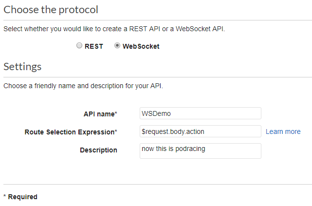
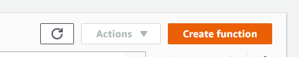
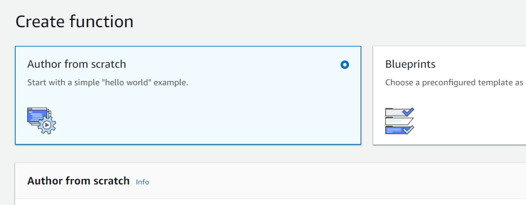
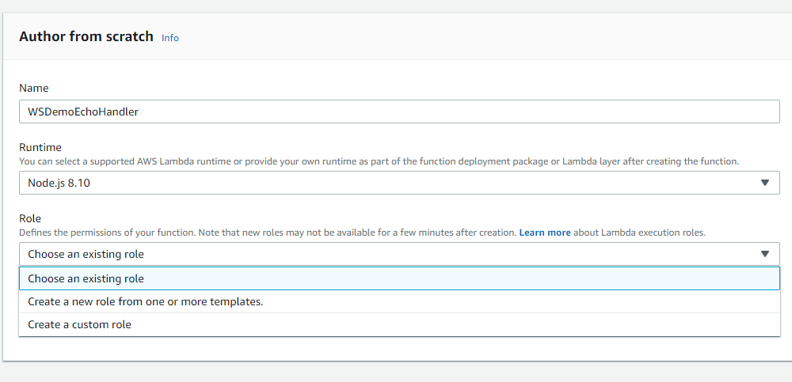
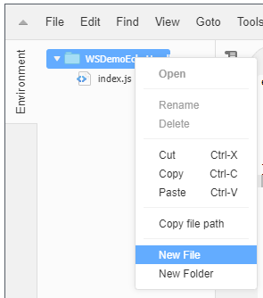
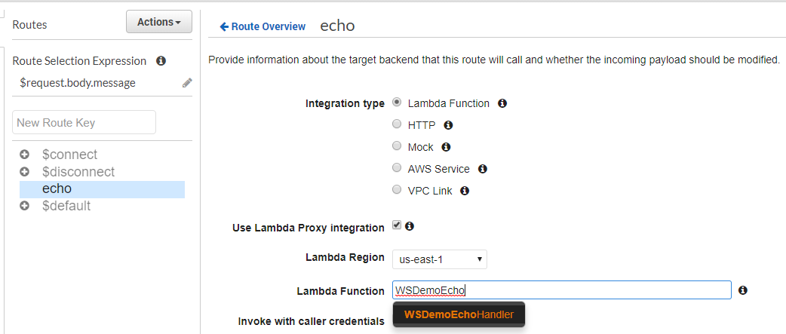
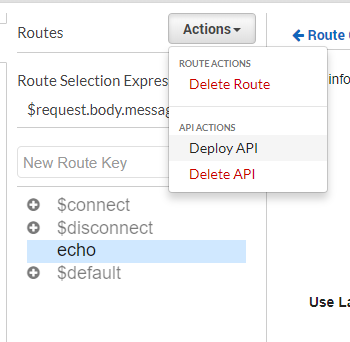
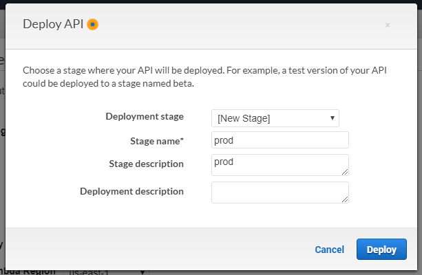

This is a simple WebSocket app that echos whatever the client sends. 

In console window A:
```bash
npm install

# start server
node server.js
```

In console window B:
```bash
# start client
node client.js ws://localhost:8080
```

Now type something into the console window B and it be echoed back. 

We begin with a simple NodeJS client that talks to wss://echo.websocket.org:

```
const WebSocket = require('ws');
const readline = require('readline');

const url = process.argv[2];
const ws = new WebSocket(url);

ws.on('open', () => console.log('connected'));
ws.on('message', data => console.log(`From server: ${data}`));
ws.on('close', () => {
    console.log('disconnected');
    process.exit();
});

readline.createInterface({
    input: process.stdin,
    output: process.stdout,
}).on('line', data => {
    ws.send(data);
});

```

If we want to implement the echo server functionality locally:

```
const WebSocket = require('ws');
const wss = new WebSocket.Server({port: 8080});

wss.on('connection', socket => {
    socket.on('message', data => {
        socket.send(data);
    });
});

console.log(`Listening on ws://localhost:8080`);
```

Those ten lines of code are actually doing several things:

- Accepting incoming websocket connections
- Listening for incoming messages
- Giving the message handler access to the source socket, on which to send data back to the client
- (Implicitly) handling client disconnect

If we pasted this code into a serverless function, it would need to run constantly to handle incoming connection requests, which violates the on-demand nature of the serverless functions.

However, if we isolate the inner echo logic as a serverless function, we would need to provide some way for it to communicate with the WebSockets held by the API Gateway. 

Since the serverless function is stateless, the object reference we have in the function closure above will not suffice. Rather, we need a serializable token that represents the connection, let’s call it “connectionId”:

See the file serverWithActions.js

In the process of isolating the echo function logic, we’ve also separated the responsibilities of the API Gateway, albeit as an oversimplified example.

On lines 10–28, we’re defining three special default action handlers: connect, disconnect, and default (which handles any messages that aren’t explicitly defined in customActions).

The echo custom action handler now takes connectionId and data as explicit function arguments, both of which are strings. The only external dependency is send, which we will come back to shortly

We’ve also changed the protocol to require that the client sends requests resembling {“action”: …, “data”: …}. That’s just a one line (18) change:

See file clientWithActions.js

```
# Terminal Tab A
node serverWithActions
# Terminal Tab B, note 'ws' protocol, not 'wss'
node clientWithActions ws://localhost:8080
```

Now we’re ready to create the WebSocket API in API Gateway. Log into AWS. Open AWS API Gateway, click “Create API”, select WebSocket and fill in the following settings:



Double check that the Route Selection Expression is “$request.body.action”, as this expression tells API Gateway how to determine which action to invoke.


Next, click “Create API”, and you should see the Routes page. Add “echo” as a “New Route Key” and click the check button:

In a new browser tab, open the Lambda AWS Console, click “Create Function”, then select “Author from scratch”





Give your function a name like “WSDemoEchoHandler”, and select an IAM role. If you don’t have an existing IAM role for your Lambda functions, choose “Create a custom role” and the lambda_basic_execution role will suffice.


The WebSocket API is still very new, so we need to patch in a bit of functionality to the existing aws-sdk module. In the embedded code editor, right click on your function folder and select “New File”:




Name it “patch.js” and paste in the contents of this file. Next, open “index.js” and paste the following:

```
const AWS = require('aws-sdk');
// apply the patch
require('./patch.js');

let send = undefined;
function init(event) {
  const apigwManagementApi = new AWS.ApiGatewayManagementApi({
    apiVersion: '2018-11-29',
    endpoint: event.requestContext.domainName + '/' + event.requestContext.stage
  });
  send = async (connectionId, data) => {
    await apigwManagementApi.postToConnection({ ConnectionId: connectionId, Data: `Echo: ${data}` }).promise();
  }
}

exports.handler = async(event) => {
  init(event);
  const connectionId = event.requestContext.connectionId;
  let data = JSON.parse(event.body).data
  await send(connectionId, data);
  // the return value is ignored when this function is invoked from WebSocket gateway
  return {};
};
```

Remember earlier when the local implementation of the echo function depended on the “send” function? Now we can see how it’s implemented via the aws-sdk.

Save the Lambda and return to the API Gateway console tab. In the “Lambda Function” field, enter the name of the Lambda function we just created:



This way, the API Gateway knows to invoke WSDemoEchoHandler function in response to a request to the echo “route”. Note that “route” does not refer to an HTTP route. Once the route is hooked up, we’re ready to deploy our API:



We need to define a new Deployment Stage:



Once deployed, you’ll see the Stage Editor, which shows the URL for your new WebSocket API:


Copy the text of the “WebSocket URL” field at the top. It will look like: wss://something.execute-api.us-east-1.amazonaws.com/prod.

Back in our terminal window, we can test against the new WebSocket API:

```
node clientWithActions.js wss://something.execute-api.us-east-1.amazonaws.com/prod
meow
From server: Echo: meow
```


